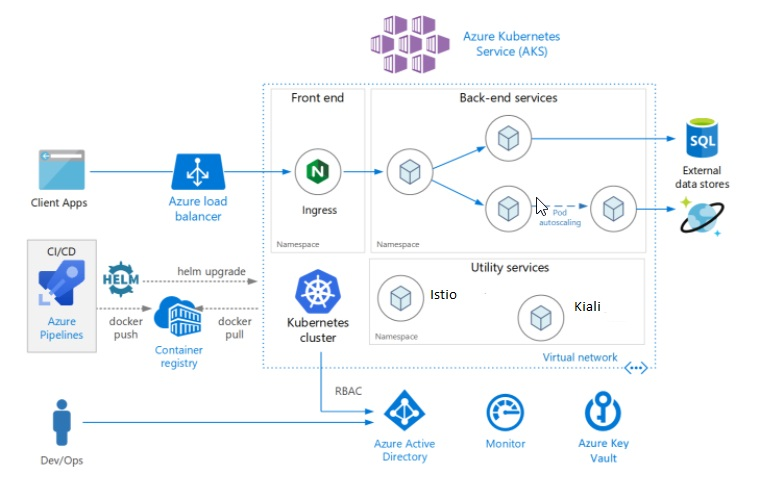

# App Modernization with Azure Kubernetes Service

Kubernetes is a popular container orchestration platform for automating the management, scaling and routing of containers. This platform provides necessary capabilities for container orchestration without the steep learning curve, simplified security configuration and simplified infrastructure.

## Overview

Canarys helps you achieve higher productivity, with cost effective solutions, reduced maintenance and better information flow leveraging Microsoft Azure Platform.

Microsoft Azure offers wide spectrum of Services under Infrastructure, Platform & Software which are commonly known as IaaS, PaaS & SaaS.

Sudden and compelling demands of Infrastructure is one of the key areas of industry which historically proven to be expensive and time consuming. Getting it done right the first time is highly critical to avoid costly failure.

## Architecture

## Target Audience

- DevOps Engineers
- Developers
- Architects
- Developer Leads
- Infrastructure Leads

## Key Features and Benefits

- Get expert assistance on defining the ideal Azure workloads in appropriate regions with cost estimates
- Defining right strategy of deployments, networking and services
- Maximize your investment with trusted integrations and apps

## Delivery Methods

- Remote
- Onsite

## Syllabus

This engagement focuses on Implementation and management of Kubernetes and DevOps platform for more secure, agile and sustainable development of modern scalable applications. Activities and deliverables associated with this setup may include the following, subject to additional scoping:

### Phase-1

- Discussion on the scope of engagement 
- Identify candidate application(s)
- Assess the ideal state of migration with Azure migration assistant tool
- Azure account set up, policies and compliance
- Defining ideal Azure workloads in appropriate region with Azure cost estimates
- Migration roadmap and plan

### Phase-2

- Creation of basic webapp Docker files and Docker compose files
- Building of Docker images with tags and creating ACR
- Pushing images to ACR and setting up of Azure DevOps
- Creation of AKS cluster using AZ cli and configuring Deployment Manifests 
- Defining right strategy of deployment, networking and services

### Phase-3

- Deployment of application into the cluster
- Defining Monitoring solutions with Azure Monitor, App insights and Log analytics
- Defining horizontal pod auto scaler and cluster Auto scaler for self-healing and scaling
- Defining ingress and Application gate way or AGIC and Network polices for traffic routing and network Security
- Enablement of CI/CD with Azure DevOps with automated tasks
- Defining best guide to operating and managing the AKS environment

## Business Outcomes

After this engagement, your teams will be able to:

- Build DevOps pipeline for Container workloads
- The teams will have the foundational functional knowledge on Docker, Kubernetes and AKS
- Implement simple AKS with Kubernetes infrastructure at their organizations.